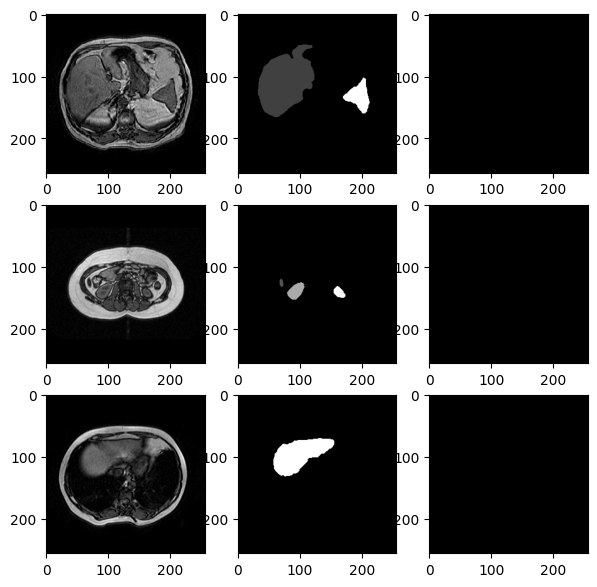
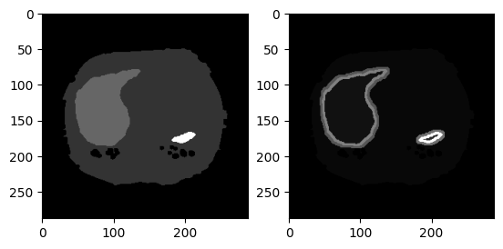
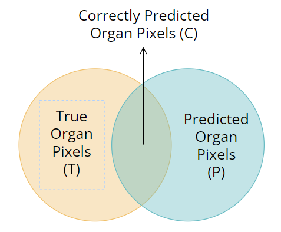
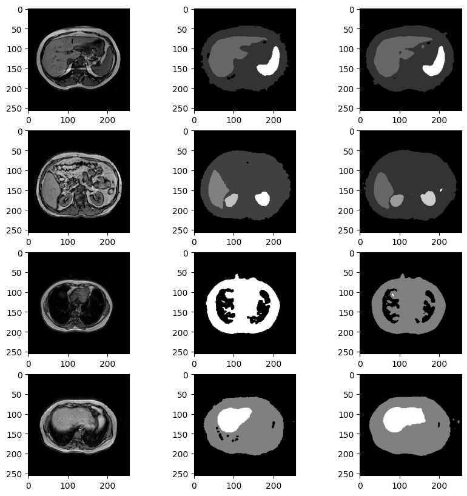

<style>
green {
    color: #74D800;
}
pink {
    color: #FF88FF;
}
blue {
    color: #66CCFF;
}
bblue {
    color: #66CCFF;
    font-weight: bold;
}
yl {
    color: #CBB077;
}
.float-img {
    float:right;
    margin: 0 0 0 15px;
}
.img-container {
    display: flex;
    align-items: center;
    justify-content: center;
    vertical-align: center;
}
</style>

# Report project for Biomedical Computer Vision 1st semester 2023/2024
Author: Giacomo Pauletti  
  
In this repository there is my personal solution for the [CHAOS challenge](https://chaos.grand-challenge.org/).  
Specifically, I'm solving the Task 5:  
> "5) **Segmentation of abdominal organs (MRI only)**: The same task given in "Task 3" but extended to four abdominal organs; liver, kidneys, spleen. In this task, ensemble or fusion of individual systems between MR sequences (i.e. two models, one working on T1-DUAL and the other on  T2-SPIR ) are allowed." (CHAOS challenge website)  

>"3) **Liver Segmentation (MRI only)**: Similar to "Task 2", this is also a regular task of liver segmentation from MRI. It includes two different pulse sequences: T1-DUAL and T2-SPIR. Moreover, T1-DUAL has two forms (in and out phase). The developed system should work on both sequences. In this task, the fusion of individual systems between MR sequences (i.e. two models, one working on T1-DUAL and the other on  T2-SPIR ) are allowed."(CHAOS challenge website)

  
Until now I wrote a partial solution, in which I'm segmenting the abdominal organs only for T1-DUAL OutPhase sequence, but I'm planning to solve it also for T1-DUAL InPhase and T2-SPIR sequences.  
  
In this notebook I explain step by step my model, illustrating also the models I wrote initially and what I'm planning to do in future.  

General information:
* All models are adapted versions of `U-Net` model.  
* Main library used are `tensorflow`, `keras`,`PIL` and `cv2`(OpenCV)
* Every model was trained on [Google Colab](https://colab.google/) with free subscription

Useful sources and bibliography at the [bottom](#sources-and-bibliography)

## Dataset preprocessing
Firstly, I preprocessed the dataset. I discovered more and more changes to do throughout the time, tipically for making the model predicting more accurately.  
The dataset went trough the following operations:
1. <bblue>Image reordering</bblue> and rename
2. <bblue>Conversion</bblue> from `.dicom` to `.png`
3. <bblue>Pixel intensity normalization</bblue> to range [0-255]
    * Images hadn't the same intensity range
4. <bblue>Mask one-hot encoding</bblue>
    * used for Categorical Cross Entropy instead of Sparse Categorical Cross Entropy
5. <bblue>Adding a new mask class</bblue>: body
    * I needed the model to be more accurate close to the organs, for avoiding underprediction or overprediction
    * With this new class, I could assign it a different weight from background (and organs) in the Weighted Categorical Cross Entropy loss function
    * This mask was created through tresholding and morphological closure. This gave strange results in some images, could have been done better
6. <bblue> Adding new mask classes</bblue>: organ borders
    * Organ borders are highlighted new classes, to give them even stronger weights
    * For more about organ borders [click here](#fourth-model-most-accurate-by-now)


[Click here](./manual_preprocessing.ipynb) to view the full code.  

## First (not working) model
My first model choices were the following:
* I used a simple U-net, without any significant change.  
* The loss function was a Sparse Categorical Cross Entropy. I used the sparse one because I didn't onehot encoded the masks. 
* Optimizer used is Adam  
    
See [this file](./model_1.ipynb) for the code.  
  
Due it's semplicity, this model didn't give great results.  
Due to the very imbalanced classes (background is $\ge 90\%$), the model was predicting every pixel as black (background) having a very little loss.  
Here is shown a model "quality test":
``` python
model = tf.keras.models.load_model("./checkpoints/checkpoint0")
loss, acc = model.evaluate(test_dataset, verbose=2, steps=20)
# output: 20/20 - 2s - loss: nan - accuracy: 0.9496 - 2s/epoch - 101ms/step
```
I forgot to track loss but probably would be very low since (almost) all black pixels are correctly "predicted"

<div class="img-container">

</div>

## Second model (almost working)
My second model had the following features:
* It was again a very simple U-Net, nothing changed in the CNN structure from the previous model
* The loss function is **Weighted Categorical Cross Entropy**. The targetted classes have a very big weight associated (10) vs a very small weight for the background (0.01)
    * This required onehot encoding for the masks
    * I hadn't yet separated non targetted body parts from the background

Here is shown a model "quality test":
``` python
model = tf.keras.models.load_model("./checkpoints/checkpoint1")
loss, acc = model.evaluate(test_dataset, verbose=2, steps=20)
# 20/20 - 36s - loss: 0.1057 - accuracy: 0.8445 - 36s/epoch - 2s/step
```

We notice a good accuracy and a good loss, but the predictions aren't meaningful yet

<div class="img-container">

</div>

Further analysis made me think that tuning bettew loss weights (1 - 15 vs 0.01 - 10) and increasing a lot the number of epochs (5 -> ~50) would have generated much more better results
## Third model (working but improvable a lot)
In the third model I kept everything from the previous model except one thing:
* I added a class that represent the **body** of the patient (except the organs) to divide the body from the background
    * The idea behind is that I want the model to be more accurate close to the organs, so giving a different weight to the body could help

Here is shown a model "quality test":
``` python
model = tf.keras.models.load_model("./checkpoints/checkpoint1")
loss, acc = model.evaluate(test_dataset, verbose=2, steps=20)
# 20/20 - 4s - loss: nan - accuracy: 0.9463 - 4s/epoch - 216ms/step
```

## Fourth model (most accurate by now)
In the fourth model I brough a bunch of changes to the previous one:
* <bblue>New model structure</bblue>: _fine tuning from ResNet101_
    * I'm using as encoder the ResNet101 importing the parameters from the ResNet trained on ImageNet
    * ResNet parameters are not trained, only the decoder is trained
* <bblue>New classes in the masks</bblue>: _borders_
      
    * For every organ mask I automatically detected the borders, in the following way:
        * for every pixel, if it's belonging to class A and is confining with a pixel of class B, it will be added to class AB 
            * viceversa for other pixel, which will be added to class BA (different from AB)
    * So **every organ border has 2 "layers"**: inner one will be AB (organ A, background B), outer one will be BA
        * The border is used to **give more weight in the loss function** to this parts of the image (avoiding over/under prediction of organs)
        * It is layered to effectively **separate which pixels are backround (BA) and which organ (AB)**
    * Every border will have it's own weight, for this model I used the following weights
        * Background: 1; Body: 3; Liver: 9; Right&Left kidney, spleen: 14; **Borders: 18**
    * This approach is highly **inspirated from the U-Net paper**, in which the authors gave much more weight to the cell borders than to the cells, to avoid having a prediction of a unique big cell
    * Example at the right


* <bblue>New evaluation metrics</bblue>: _accuracy is not a good parameter_
    * I'm using 2 new metrics: 
        
        * **correct_over_total_predicted** (cotp): percentage of pixel of right class from those I predicted (so escluding what my model predicted as background or body)
            * if it's low, it could mean that the model is overpredicting organs (as model 2 did)
            * if it's high, it means that all predicted pixels are indeed organs (but it doesn' mean that I'm predicting all organ pixels, for this reason cott is needed)
            * from the image, $COTP = \frac{C}{P}$
        * **correct_over_total_true** (cott): percentage of pixel correctly predicted over the total amount pixels (so escluding what is really the background or body)
            * this is equal to accuracy but I implemented it **just for organs and borders**
            * it is then not affected by the number of correct background pixels, which will be very high
            * if it's low, it means that not much organ pixels are predicted (but cotp could be 100%!)
            * if it's high, it means that (almost) all organ pixels are predicted correctly (but cotp could be low, if overpredicting)
            * from the image, $COTT = \frac{C}{T}$


Here is shown a model "quality test":
``` python
model = tf.keras.models.load_model("./checkpoints/checkpoint1")
loss, acc = model.evaluate(test_dataset, verbose=2, steps=20)
# 20/20 - 40s - loss: 0.9038 - accuracy: 0.9672 - cotp: 0.9676 - cott: 0.9666 - 40s/epoch - 2s/step
```  
_Correct over total predict_ (cotp) is **96.7%** which means that the **96.7% of pixels that are predicted as organs is correct**.  
_Correct over total true_ (cott) is **96.6%** which means that the **96.6% of the organ pixels are predicted correctly**  
So this model is **almost predicting correctly every pixel** and the 2 areas (T and P) are almost overlapping.  
  
**Hyperparameters** used:
* Number of epochs: 30
* Learning rate: $10^{-4}$
* Batch size: 4
* Weights: 
    * background = 1
    * body = 3
    * liver = 9
    * kidneys and spleen = 14
    * organ borders = 18
  
We notice an higher accuracy and these are some of the predictions:  
  
<div class="img-container">

</div>
  
Result could be even better applying **postprocessing morphological closure**, which eliminates sparse random organ pixels without affecting the real organs.  

## Future improvements
Here is a list of future improvements for better results:
* Currently **no data augmentation is used**, so, for a more robust model, it will be used
* The model is not receiving any explicit correlation between images of the same volume
    * I think that giving some information about the image correlation could help the model gaining better results
* I discovered a new article (here is the [link](https://arxiv.org/abs/1606.04797)) in which the authors talk about a <bblue>V-Net</bblue>, a CNN very similar to U-Net but for **volumetric images (3D)** and not 2D images, which would be better for me
* Loss function is good but could be improved, also by tuning better parameters. 
* Only 1 sequence is analyzed, T1-DUAL OutPhase. In future In future I will build models for predicting from every sequence

## Sources and bibliography
Here are some websites, papers and documentations:
* Documentations:
    * [Tensorflow documentation](https://www.tensorflow.org/api_docs/python/tf)
    * [Numpy documentation](https://numpy.org/doc/stable/reference/index.html)
    * [PIL documentation](https://pillow.readthedocs.io/en/stable/)
    * [OpenCV documentation](https://docs.opencv.org/4.x/)
* Websites:
    * [Multi-class Image Segmentation with U-Net](https://kiansoon.medium.com/semantic-segmentation-is-the-task-of-partitioning-an-image-into-multiple-segments-based-on-the-356a5582370e) which inspired me a lot
    * [Custom metrics article](https://medium.com/analytics-vidhya/what-nobody-tells-you-about-binary-classification-metrics-4998574b668)
    * [Custom Weighted Categorical Cross Entropy](https://medium.com/the-owl/weighted-categorical-cross-entropy-loss-in-keras-edaee1df44ee)
    * [Google Colab](https://colab.google/) which hosted all the model trainings
* Papers:
    * [U-Net: Convolutional Networks for Biomedical Image Segmentation](https://arxiv.org/abs/1505.04597)
    * [Deep Neural Networks Segment Neuronal Membranes in Electron Microscopy Images](https://papers.nips.cc/paper_files/paper/2012/hash/459a4ddcb586f24efd9395aa7662bc7c-Abstract.html) 
