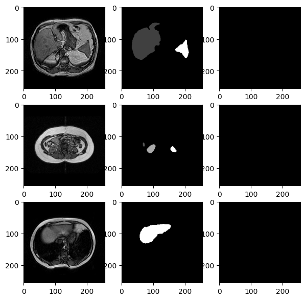

<style>
green {
    color: #74D800;
}
pink {
    color: #FF88FF;
}
blue {
    color: #66CCFF;
}
yl {
    color: #CBB077;
}
.img-container {
    display: flex;
    justify-content: center;
}
.img-container {
    display: flex;
    align-items: center;
    justify-content: center;
    vertical-align: center;
}
</style>

# Report project for Biomedical Computer Vision 1st semester 2023/2024
Author: Giacomo Pauletti  
  
In this repository there is my personal solution for the [CHAOS challenge](https://chaos.grand-challenge.org/).  
Specifically, I'm solving the Task 5:  
> "**Segmentation of abdominal organs (MRI only)**: The same task given in "Task 3" but extended to four abdominal organs; liver, kidneys, spleen. In this task, ensemble or fusion of individual systems between MR sequences (i.e. two models, one working on T1-DUAL and the other on  T2-SPIR ) are allowed." (CHAOS challenge website)  
  
Until now I wrote a partial solution, in which I'm segmenting the abdominal organs only for T1-DUAL sequence, but I'm planning to solve it also for T2-SPIR sequence.  
  
In this notebook I explain step by step my model, illustrating also the models I wrote initially and what I'm planning to do in future.  

General information:
* All models are adapted versions of U-Net model.  
* Main library used are tensorflow, keras and PIL

### First (not working) model
My first model choices were the following:
* I used a simple U-net, without any significant change.  
* The loss function was a Sparse Categorical Cross Entropy. I used the sparse one because I didn't onehot encoded the masks. 
* Optimizer used is Adam  
    
See [this file](./model_1.ipynb) for the code.  
  
Due it's semplicity, this model didn't give great results.  
Due to the very imbalanced classes (background is $\ge 90\%$), the model was predicting every pixel as black (background) having a very little loss.  
Here is shown a model "quality test":
``` python
model = tf.keras.models.load_model("./checkpoints/checkpoint0")
loss, acc = model.evaluate(test_dataset, verbose=2, steps=20)
# output: 20/20 - 2s - loss: nan - accuracy: 0.9496 - 2s/epoch - 101ms/step
```
I forgot to track loss but probably would be very low since all black pixels are correctly "predicted"

<div class="img-container">

</div>

### Second model (almost working)
My second model had the following features:
* It was again a very simple U-Net, nothing changed in the CNN structure from the previous model
* The loss function is Weighted Categorical Cross Entropy. The targetted classes have a very big weight associated (10) vs a very small weight for the background (0.01)
    * This required onehot encoding for the masks
    * I hadn't yet separated non targetted body parts from the background

Here is shown a model "quality test":
``` python
model = tf.keras.models.load_model("./checkpoints/checkpoint1")
loss, acc = model.evaluate(test_dataset, verbose=2, steps=20)
# 20/20 - 36s - loss: 0.1057 - accuracy: 0.8445 - 36s/epoch - 2s/step
```

We notice a good accuracy and a good loss, but the predictions aren't meaningful yet

<div class="img-container">

</div>

